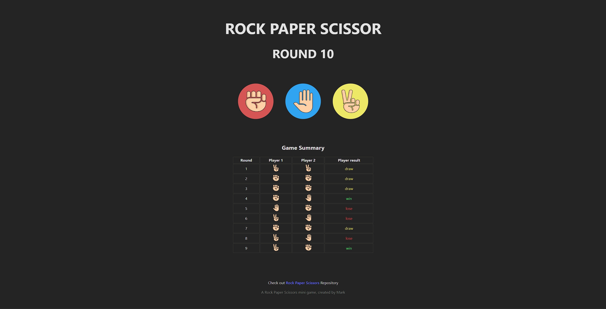

# Dockerized Laravel & Vue.js Rock-Paper-Scissors Game

## Prerequisites
- Docker (my version v4.38)
- Docker Compose

## Project Structure
- `backend/`: Laravel API (runs on port 8000)
- `frontend/`: Vue.js application (runs on port 5173)

## How to Run
1️⃣. Clone the repository:
   ```bash
   git clone https://github.com/krisan012/RockPaperScissor
   ```
```bash
cd RockPaperScissor
```

```bash
cp backend/.env.example backend/.env
```
```bash
cp frontend/.env.example frontend/.env
```

2️⃣ Composer install
```bash
cd backend
```
```bash
composer install
```


3️⃣ Run Docker Containers
Run the following command to build and start all services:
```shell
docker-compose up -d --build
```

4️⃣ Access the Application

Service	URL
```
http://localhost:5173
```

📂 Project Structure
```bash
/project
├── backend/       # Laravel API
├── frontend/      # Vue.js Frontend
├── docker/        # Docker configuration
├── docker-compose.yml
├── README.md
```

